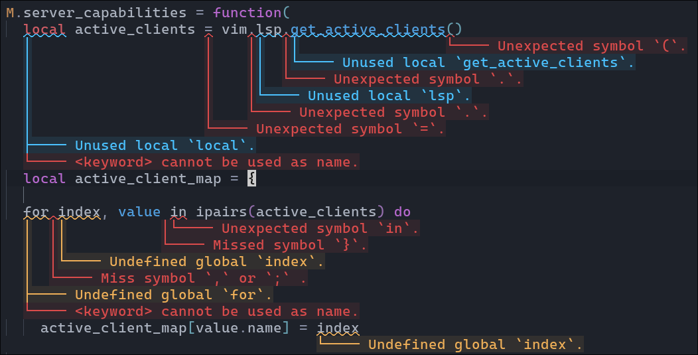

# colorblender.py

A python script to blend hex colors

 

## Usage

Accepts two hex colors and an alpha in the following order:

```
foreground background alpha
```

The closer the alpha is to `0` the more prominent the background will be in the resulting color 

The closer the alpha is to `1` the more prominent the foreground will be in the resulting color 

*NOTE:* `#` is interpreted as a comment so we need to wrap the input in quotes

```sh
$ python colorblender.py '#ffffff' '#000000' 0.1
#1a1a1a
```

```sh
$ python colorblender.py ffffff 000000 0.1
#1a1a1a
```

## References & Credit

[tokyonight.nvim](https://github.com/folke/tokyonight.nvim)
